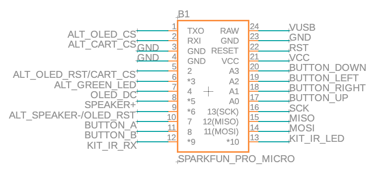

# Arduboy Kit

This repository includes all of the files you need to build your own Arduboy Kit

## Important Notes

Arduboy Kit uses the "Alternate Wiring" pinout configuration. The pins necessary to match the production Arduboy FX are not available on the Pro-Micro module, and thus alternate assignments are made in software, at compile time using a custom board file. All code for the Arduboy Kit must be compiled for alternate wiring.

Solder jumpers are available on the back of the PCB, to switch to a standard wiring configuration, however this requires placing a PNP transistor along with a resistor. This modification is currently undocumented.

Additionally, Infrared LED has been placed instead of the Red led usually on Pin 9. An Infrared receiver has it's data pin instead of the Blue led usually on Pin 10.

## Eagle and Gerber Board Files

Use your favorite PCB board manufacturer to produce your own circuit boards. Files are contained within the Board Files folder

## Bill of Materials

List of required materials along with URL links to source the components. The links are for reference only, and are not endorsements of any particular seller. Purchase at your own discretion.

## Instructions

For instructions how to assemble the board are available within this repo:
<a href="./Instructions.html">Web Instructions</a>
<a href="./Instructions.pdf">Print Instructions</a>

A web utility for flashing all of the games to the Kit is within this repo:
<a href=".index.html">Arduboy Kit Web Flasher</a>
and hosted at:
<a href="arduboy.github.io/Kit">arduboy.github.io/Kit</a>

## 3d Printables

The step file for the Arduboy Kit and an example bottom clamshell case are available within the 3d Files folder.
