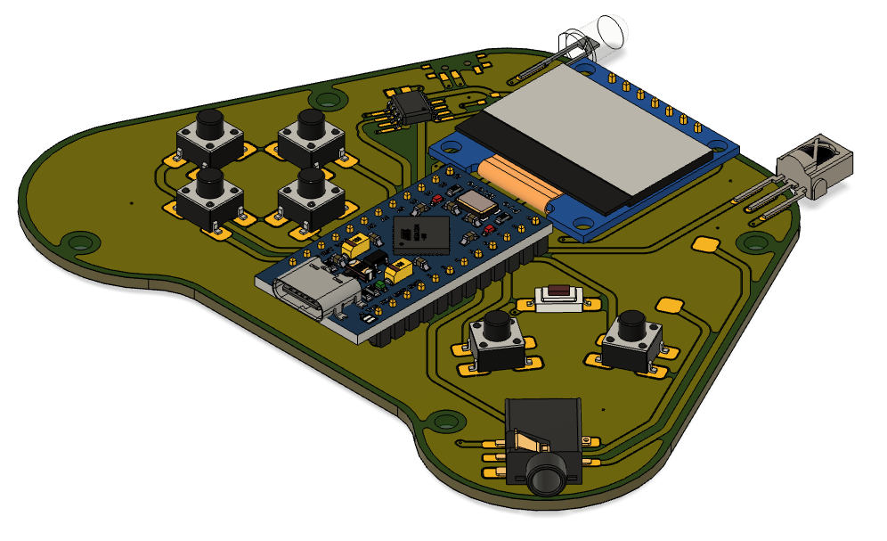

# Arduboy Kit

This repository includes all of the files you need to build your own Arduboy Kit

## Eagle and Gerber Board Files

Use your favorite PCB board manufacturer to produce your own circuit boards. Files are contained within the Board Files folder

## Bill of Materials

List of required materials along with URL links to source the components. The links are for reference only, and are not endorsements of any particular seller. Purchase at your own discretion.

## Instructions

For instructions how to assemble the board are available within this repo and at the minisite: arduboy.com/kit

## 3d Printables

The step file for the Arduboy Kit and an example bottom clamshell case are available within the 3d Files folder.
